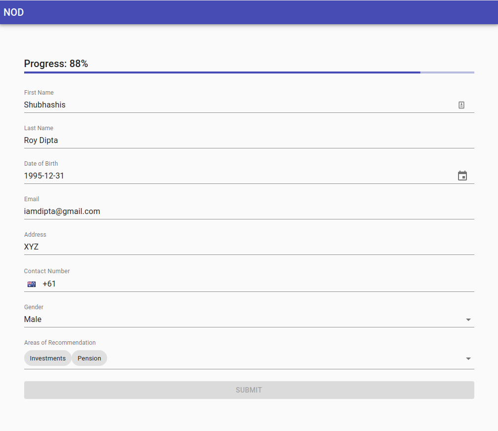

# NOD Dynamic Form
> A dynamic form created using React, Material-UI, YUP

### Live on: [github.io](https://dipta007.github.io/nod-form/)

## Installation

Run `npm install` or `yarn` (yarn preferred)

## Testing 

Run `npm run test` or `yarn test`

## Run

Run `npm run start` or `yarn start`  
It will be live on `localhost:3000`

## Build

Run `npm run build` or `yarn build`  
The build will be available on [Build Folder](./build)